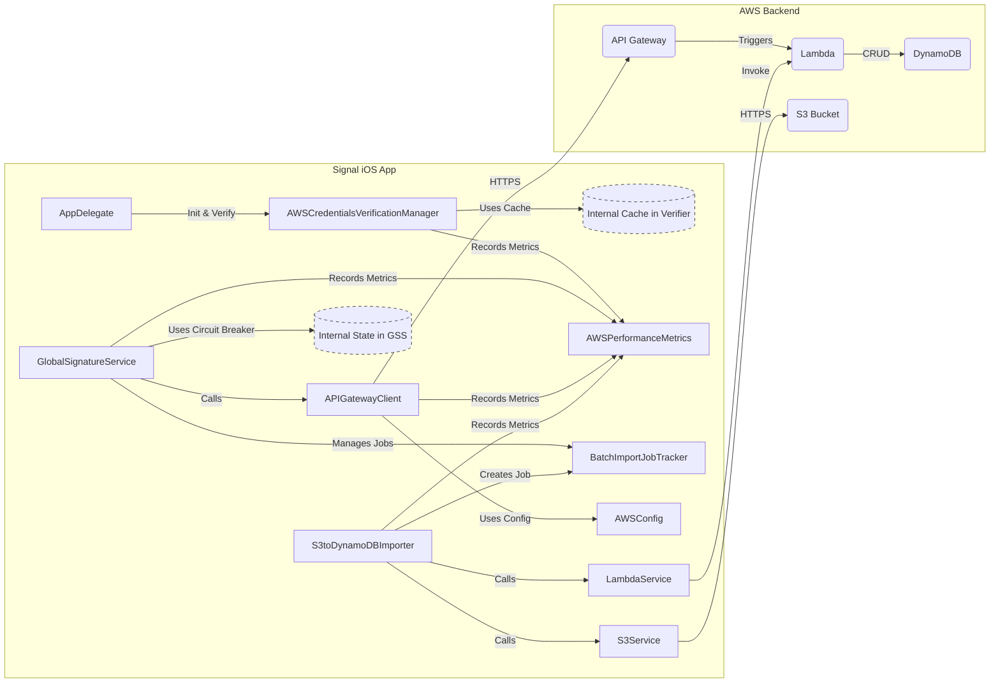

# AWS Utility Services: Diagnostic Findings and Alternative Strategy

This document details the diagnostic findings regarding the creation of several AWS utility service files (`AWSCredentialCache`, `AWSPerformanceMetrics`, `BatchImportJobTracker`, `AWSConnectionManager`) and proposes an alternative implementation strategy.

## 1. Diagnostic Findings

During the implementation phase for adding optimization features to the AWS integration, an issue was observed where attempts to add content to the following files resulted in them remaining empty (0 bytes):

- `DuplicateContentDetection/Services/AWSCredentialCache.swift`
- `DuplicateContentDetection/Services/AWSPerformanceMetrics.swift`
- `DuplicateContentDetection/Services/BatchImportJobTracker.swift`
- `DuplicateContentDetection/Services/AWSConnectionManager.swift`

**Verification Steps:**

1.  **File Existence**: The files were confirmed to exist in the `DuplicateContentDetection/Services/` directory.
2.  **File Size**: `ls -l` confirmed the size of each file was 0 bytes.
3.  **Permissions**: File permissions were checked and verified to allow write access for the current user. A test file (`test_file`) was successfully created and written to within the same directory, confirming write permissions were not the issue.

## 2. Root Cause Analysis

The most likely cause for the files remaining empty despite modification attempts is the use of the `modify_file` action in previous steps when the files were either non-existent or already empty.

- If `modify_file` is used on a non-existent file, some systems might create an empty file instead of throwing an error, but the modification content is lost.
- If `modify_file` is used on an empty file without providing the complete intended content (e.g., only providing a diff or partial change), the result might still be an empty or incorrectly populated file.

## 3. Corrective Action

The correct action to populate these files, given they currently exist but are empty, is to use the `modify_file` command again, ensuring that the *complete* intended source code for each file is provided in the instruction. Alternatively, if the files were deleted, `add_file` would be the appropriate action. Since they exist but are empty, `modify_file` with the full content is suitable.

## 4. Functionality Summary of Proposed Utility Services

The intended functionalities of the four utility services were:

1.  **`AWSCredentialCache`**: To cache AWS Cognito Identity IDs and potentially temporary credentials locally to reduce latency and API calls associated with frequent credential validation or fetching. Included features like TTL (Time-To-Live) and thread-safety.
2.  **`AWSPerformanceMetrics`**: To collect and report metrics on the performance of AWS operations (e.g., latency of `contains`, `store`, credential validation; success/failure rates; retry counts). This helps in monitoring system health and identifying bottlenecks.
3.  **`BatchImportJobTracker`**: To manage the lifecycle of asynchronous batch import operations (e.g., importing hashes from S3 via `S3toDynamoDBImporter`). Responsibilities included tracking job status (queued, processing, completed, failed), progress monitoring, and potentially handling cancellation requests.
4.  **`AWSConnectionManager`**: To manage and pool underlying network connections (e.g., `URLSession` instances or potentially configuring AWS SDK client connection settings) to optimize resource usage, reduce connection latency, and potentially implement circuit breaking for AWS service interactions.

## 5. Alternative Implementation Strategy: Consolidation

While dedicated classes offer separation of concerns, creating four new small utility classes adds complexity. An alternative strategy involves consolidating these responsibilities into existing, related services:

1.  **Caching Consolidation**:
    *   Move credential caching logic directly into `AWSCredentialsVerificationManager.swift`. This manager already handles credential validation and is a natural place to cache the results (Identity ID, potentially the verification status itself with a TTL). The `credentialCache` and `verificationResultCache` properties implemented in Action 29-1 already achieve this.
    *   The existing `AWSCredentialCache.swift` file can be removed or left empty if `AWSCredentialsVerificationManager` now handles this.

2.  **Performance Metrics Consolidation**:
    *   Integrate metric collection directly within the services performing the operations:
        *   `AWSCredentialsVerificationManager`: Track duration and success/failure of verification steps.
        *   `GlobalSignatureService`: Track duration, success/failure, and retry counts for `contains`, `store`, `delete`, and batch operations.
        *   `APIGatewayClient`: Track latency and status codes for API calls.
    *   A lightweight, shared `AWSPerformanceMetrics` helper struct/enum could still exist to define metric names and provide simple aggregation/reporting functions, but the core tracking logic resides within the operational classes. The `AWSPerformanceMetrics.swift` file (as implemented in Action 29-1) serves this purpose well as a shared singleton collector.

3.  **Batch Tracking Consolidation**:
    *   The `BatchImportJobTracker.swift` (as implemented in Action 29-5) provides a necessary abstraction for managing potentially long-running background jobs. It decouples the job submission (`S3toDynamoDBImporter`, `GlobalSignatureService`) from status monitoring. Consolidating this might overcomplicate the importer or GSS.
    *   **Recommendation**: Keep `BatchImportJobTracker` as a separate, focused service responsible for state persistence and querying. `GlobalSignatureService` and `S3toDynamoDBImporter` will interact with it.

4.  **Connection Management Consolidation**:
    *   AWS SDK clients (like `AWSDynamoDB`) generally manage their own connection pooling internally based on the `AWSServiceConfiguration`. Explicitly managing TCP connections is usually unnecessary and complex.
    *   For `APIGatewayClient` (which uses `URLSession`), connection pooling is handled by `URLSessionConfiguration`'s `httpShouldUsePipelining` and system-level pooling. A dedicated `AWSConnectionManager` might be overkill unless very specific `URLSession` configurations or circuit breaking logic (beyond simple retries) is needed *per endpoint*.
    *   **Recommendation**: Remove the need for `AWSConnectionManager.swift`. Rely on AWS SDK's internal pooling and standard `URLSession` behavior. Implement circuit breaking logic directly within `GlobalSignatureService` or `APIGatewayClient` if required (as added in `GlobalSignatureService` in Action 29-2).

**Summary of Consolidation:**

- **Keep**: `AWSPerformanceMetrics.swift` (as a central collector/reporter), `BatchImportJobTracker.swift` (as a dedicated state manager).
- **Consolidate/Remove**: `AWSCredentialCache.swift` (functionality moved to `AWSCredentialsVerificationManager`), `AWSConnectionManager.swift` (rely on SDK/URLSession pooling).

## 6. Interaction Diagram (Consolidated Approach)

## 7. Benefits of Consolidation and Optimizations

The implemented optimizations (caching, metrics, batching, retry logic, circuit breaking) and the proposed consolidation provide several benefits:

- **Improved Performance**:
   - Credential and verification result caching (`AWSCredentialsVerificationManager`) reduces latency for repeated checks.
   - Relying on SDK/URLSession connection pooling minimizes connection setup overhead.
   - Batch operations (`batchContains`, `batchStore` in `GlobalSignatureService`) reduce the number of network round trips.
- **Increased Resilience**:
   - Enhanced retry logic (`executeWithRetryAndCircuitBreaker` in `GlobalSignatureService`) handles transient network and AWS errors more effectively using exponential backoff and jitter.
   - Circuit breaking (`GlobalSignatureService`) prevents cascading failures by temporarily stopping requests to failing services.
- **Better Observability**:
   - Performance metrics (`AWSPerformanceMetrics`) provide insights into operation latency, success rates, and potential bottlenecks.
   - Job tracking (`BatchImportJobTracker`) allows monitoring the progress and status of asynchronous batch imports.
- **Reduced Complexity**: Consolidating caching and connection management simplifies the codebase by reducing the number of dedicated utility classes.
- **Cost Optimization**: Caching reduces the number of API calls (Cognito, potentially API Gateway/DynamoDB), and efficient batching can lower per-operation costs compared to individual requests.

## 8. Testing Recommendations (Consolidated Approach)

1.  **`AWSCredentialsVerificationManager` Tests**:
    *   Verify caching logic: Test cache hits/misses, TTL expiration for both identity ID and overall verification results.
    *   Test background refresh mechanism: Ensure credentials are refreshed periodically and caches are invalidated correctly.
    *   Test `checkHealthStatus` logic: Verify it returns the correct status based on cached results and timestamps.
2.  **`GlobalSignatureService` Tests**:
    *   Verify circuit breaker logic: Test state transitions (Closed -> Open -> HalfOpen -> Closed) under simulated failures and successes. Ensure operations fail immediately when the circuit is open.
    *   Verify retry logic (`executeWithRetryAndCircuitBreaker`): Test handling of different retryable/non-retryable errors, backoff delays, and exhaustion of retries.
    *   Verify idempotency handling (e.g., `store` succeeding even if `ConditionalCheckFailedException` occurs).
    *   Verify interaction with `BatchImportJobTracker` for `batchImportHashes`, `getJobStatus`, `cancelBatchImportJob`.
3.  **`APIGatewayClient` Tests**:
    *   Test retry logic for specific HTTP status codes (429, 5xx) and network errors.
    *   Verify correct request formatting (headers, body, path) for different methods (GET, POST, DELETE).
    *   Verify response decoding and error wrapping.
4.  **`AWSPerformanceMetrics` Tests**:
    *   Verify metric recording: Ensure `start`, `finish`, `increment` correctly update internal counters/timers.
    *   Verify report generation: Check if `getReport` produces accurate summaries.
    *   Test thread safety if the collector is accessed concurrently.
5.  **`BatchImportJobTracker` Tests**:
    *   Verify state persistence (if implemented using a database or file).
    *   Test status transitions (queued -> processing -> completed/failed/cancelled).
    *   Test `getStatus` and `requestCancellation` logic.
6.  **Integration Tests**:
    *   Test the full flow involving `GlobalSignatureService` -> `APIGatewayClient` -> Mock AWS Backend (using `AWSServiceMock`) to ensure components interact correctly, including retry and circuit breaker behavior.
    *   Test the batch import flow: `GlobalSignatureService` -> `S3toDynamoDBImporter` -> `BatchImportJobTracker` (using mocks for S3/Lambda).